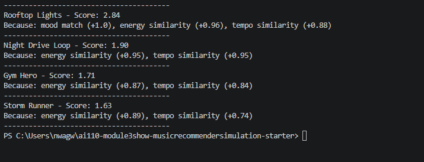
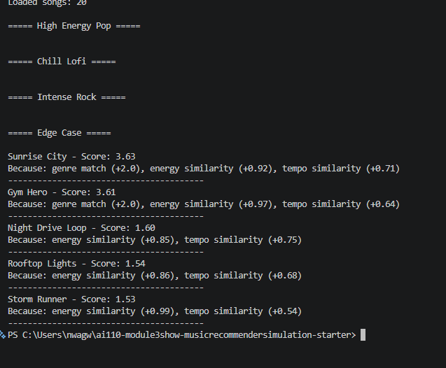

# 🎵 Music Recommender Simulation

## Project Summary

This project builds a simple content-based music recommender system. It represents songs and a user’s taste profile as data, then applies a scoring system to recommend songs that best match the user’s preferences. The system focuses on matching musical “vibe” using features like genre, mood, energy, and tempo.

---

## How The System Works

Modern recommendation systems like Spotify and YouTube use a combination of collaborative filtering and content-based filtering. Collaborative filtering uses patterns from similar users, while content-based filtering compares item features (such as genre or mood) to a user’s preferences. These systems rely on large amounts of user data like likes, skips, and listening time.

In this simulation, a content-based approach is used. The system compares a user’s preferences with song features and assigns each song a score based on similarity. Genre and mood are prioritized to capture the overall vibe, while energy and tempo fine-tune the recommendations. Songs are ranked by score, and the top matches are recommended.

---

### Features Used

**Song:**
- genre  
- mood  
- energy  
- tempo_bpm  

**UserProfile:**
- genre  
- mood  
- energy  
- tempo  

---

### Algorithm Recipe

- +2.0 points for genre match  
- +1.0 point for mood match  
- Energy is scored based on how close it is to the user’s preferred value  
- Tempo is scored based on how close it is to the user’s preferred value  

Songs are ranked from highest to lowest score, and the top matches are recommended.

---

### System Flow

1. Input: User preferences (genre, mood, energy, tempo)  
2. Process: Loop through each song in the dataset  
3. Compare each song to user preferences  
4. Assign a score based on matches and similarity  
5. Rank all songs by score  
6. Output: Top 3–5 recommended songs  

---

### Key Features Identified

The most effective features for this recommender are:

- genre – defines the style of music  
- mood – captures emotional tone  
- energy – measures intensity  
- tempo_bpm – indicates speed  

Genre and mood define the core vibe, while energy and tempo refine it.

---

### Potential Bias

This system may over-prioritize genre, which could cause it to ignore songs from other genres that still match the user’s mood and energy. It also assumes users have fixed preferences and does not adapt over time like real-world systems.


---


## Getting Started

### Setup

1. Create a virtual environment (optional but recommended):

```bash
python -m venv .venv
source .venv/bin/activate      # Mac or Linux
.venv\Scripts\activate         # Windows